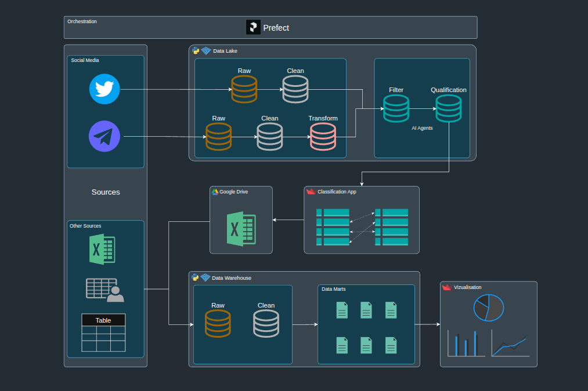

# Russia-Ukraine War Analytics Hub 🇺🇦🇷🇺

Repo featuring a wealth of data, graphs and analyses relating (directly or indirectly) to the war between Russia and Ukraine.
 

## 🔗 Applications Web

 
 

# Sections

## 🚂 Incidents Russian Railways Analytics 🇷🇺

This section contains data and analyses related to incidents involving Russian Railways, including accidents, fire, derailments, disruptions, and other significant events.

Data sources from Telegram channels and Twitter are collected, filtered, and pre-classified to identify relevant incidents.

 

## 🚫 Websites Blocked in Russia

This section provides a charts of websites that have been blocked in Russia, including those blocked by Roskomnadzor and other entities. The data is sourced from [**data source**](https://www.top10vpn.com/research/websites-blocked-in-russia/).

 

## ⚙️ Components in Aggressor's Weapon

This section contains data and analyses related to the components used in the aggressor's weaponry, including their origins, manufacturers.
	The data is sourced from [**data source**](https://war-sanctions.gur.gov.ua/en/components).

 

## Raid Alerts in Ukraine 🚨

This section provides data related to raid alerts in Ukraine, multiple sources are available.

 

## 🗺️ Interactive Maps

This section provides lists of interactive maps related to the war in Ukraine.

 
 

# Architecture

