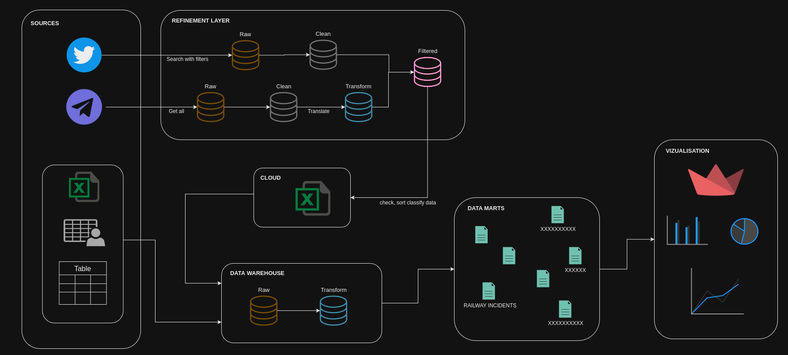

# Russia-Ukraine War Analytics Hub 🇺🇦🇷🇺

Repo featuring a wealth of data, graphs and analyses relating (directly or indirectly) to the war between Russia and Ukraine.

 

## 🔗 Applications Web

 

# Sections

## 🚂 Incidents Russian Railways Analytics 🇷🇺

This section contains data and analyses related to incidents involving Russian Railways, including accidents, fire, derailments, disruptions, and other significant events.

Data sources from Telegram channels and Twitter are collected, filtered, and pre-classified (with AI agents) to identify relevant incidents.

- **[Dataset Incidents Russian Railway](https://docs.google.com/spreadsheets/d/1jyD1bB0uauqIo-Bsi_qoBqV9JAu7cUXvG0UzZmFrSPk/edit?pli=1&gid=0#gid=0)**

### Overview Tab Charts

| Title | Description |
| ------- | ------------- |
| Annual Railway Incidents in Russia | Number of incidents by year displayed as a bar chart. |
| Monthly Incident Trends on Russian Railways | Monthly trends displayed as a line chart. |
| Monthly Incident Trends on Russian Railways | Monthly trends displayed as a bar chart. |
| Railway Incidents by Type in Russia | Distribution of incidents by type as a bar chart. |
| Railway Damaged Equipments in Russia | Overview of damaged equipment in incidents. |
| Distribution of Railway Incidents by Region in Russia | Regional incident distribution shown as a treemap. |
| Geographic Distribution of Sabotages on Russian Railways | Regional sabotage data displayed on a map. |
| Distribution of Railway Incidents by Day of the Week in {year} | Weekly incident patterns shown as heatmaps (one per year). |

 

### Incidents Types Tab Charts

| Title | Description |
| ------- | ------------- |
| Distribution of Incidents by Type | Distribution of reported incidents categorized by type. |
| Trends in Cumulative Incidents by Type Over Time | Cumulative number of incidents by type over time. |
| Incidents by Type: Yearly Comparison | A yearly comparison showing the distribution of incident types. |
| Monthly Incidents by Type | A detailed view of incidents categorized by type on a monthly basis. |
| Distribution of Damaged Equipment by Incident Type | Relationship between incident types and damaged equipment. |
| Flow of Damaged Equipment by Incident Type | A visual representation of how incident types lead to equipment damage. |
| Distribution of Incidents by Type and Region | Incidents categorized by type and region. |

 

### Damaged Equipments Tab Charts

| Title | Description |
| ------- | ------------- |
| Distribution of Damaged Equipments | Overview of damaged equipments in all incidents. |
| Trends in Cumulative Damaged Equipments Over Time | Cumulative number of damaged equipments over time displayed as a line chart. |
| Damaged Equipment: Yearly Comparison | Yearly comparison of damaged equipment incidents. |
| Monthly Damaged Equipments | Detailed monthly insights into damaged equipment incidents. |
| Distribution of Incident Types by Damaged Equipment | Relationship between damaged equipment and incident types visualized through a sunburst chart. |
| Flow of Incident Types by Damaged Equipment | A Sankey diagram showcasing how damaged equipment corresponds to incident types. |
| Distribution of Damaged Equipments by Region | Regional distribution of damaged equipment incidents visualized as a bar chart. |

 

### Collisions Tab Charts

| Title | Description |
| ------- | ------------- |
| Distribution of Collisions | Overview of collisions in all reported incidents. |
| Monthly Collisions | Monthly distribution of collision incidents. |
| Distribution of Collisions by Implicated Equipment | Collisions categorized by implicated equipment. |
| Monthly Implicated Equipments in Collisions | Monthly distribution of implicated equipment in collisions. |

 

### Sabotage Tab Charts

| Title | Description |
| ------- | ------------- |
| Annual Number of Sabotage | Yearly sabotage incident data as a bar chart. |
| Monthly Number of Sabotage by Year | Trends in monthly sabotage incidents over years. |
| Incidents vs Sabotage over Time | Line chart comparing total incidents and sabotage. |
| Distribution of Sabotage by Partisans Group | Pie chart showing sabotage distribution among groups. |
| Sabotage Incidents by Partisans Group | Scatter chart of partisans group incidents by date. |
| Treemap of Damaged Equipment with Partisan Group Attribution | Hierarchical view of damage attributed to partisans. |
| Implication of Partisans Group in Damaged Equipment | Chart showing partisan involvement in equipment damage. |
| Treemap of Partisan Groups and Associated Equipment Damage | Relationship between partisans and damaged equipment. |
| Distribution of damaged equipment of partisan groups | Bar chart of equipment damage by partisan groups. |
| Distribution of Damaged Equipment for Sabotage Incidents | Pie chart of damaged equipment in sabotage cases. |
| Monthly Number of Damaged Equipments | Monthly trends in sabotage-related equipment damage. |
| Number of Damaged Equipments by Region | Regional distribution of sabotage-related equipment damage. |
| Geographic Distribution of Sabotages on Russian Railways | Map of sabotage incidents in Russia. |

 

### Partisans Arrest Tab Charts

| Title | Description |
| ------- | ------------- |
| Funnel of Partisans Arrested | Funnel chart showing the process of partisan arrests. |
| Distribution of Sabotage where partisans were arrested | Pie chart of sabotage incidents involving partisan arrests. |
| Distribution of Applicable Laws | Treemap showing laws applied to arrested partisans. |
| Number of Partisans Age | Waffle chart displaying the age distribution of arrested partisans. |
| Number of Partisans Arrested by Age | Waterfall chart of partisans arrested by age. |
| Number of Partisans Arrested by Age Group | Waterfall chart of partisans arrested by age groups. |
| Applicable Laws by Partisans Age | Heatmap displaying laws applied categorized by partisan age. |

 

## 🚫 Websites Blocked in Russia

This section provides a charts of websites that have been blocked in Russia, including those blocked by Roskomnadzor and other entities.

- **[Data Source](https://www.top10vpn.com/research/websites-blocked-in-russia/)**

 

## ⚙️ Components in Aggressor's Weapon

This section contains data and analyses related to the components used in the aggressor's weaponry, including their origins, manufacturers.

- **[Data Source](https://war-sanctions.gur.gov.ua/en/components)**

 

## Military Losses in Ukraine

This section provides data and analyses related to military losses in Ukraine, including personnel, equipment, and other relevant information.

 | Title | Description |
 | ------- | ------------- |
 | [Equipment losses & Death Toll & Military Wounded & Prisoner of War of Russians](https://www.kaggle.com/datasets/piterfm/2022-ukraine-russian-war) | Dataset on Russian military losses in Ukraine. |
 | [UA losses](https://ualosses.org/en/soldiers/) | Ukrainian military losses tracker. |
 | [Russian Losses in Ukraine](https://www.ukrainewarlosses.com/) | Tracker for Russian military losses. |
 | [Russian Casualties in Ukraine](https://russian-casualties.in.ua/) | Data on Russian casualties in Ukraine. |
 | [Russo-Ukrainian Warspotting](https://ukr.warspotting.net/) | Warspotting data for the Russo-Ukrainian conflict. |

 

## Raid Alerts in Ukraine 🚨

This section provides data related to raid alerts in Ukraine, multiple sources are available.

| Title                                                                                              | Description                                                   |
| -------------------------------------------------------------------------------------------------- | ------------------------------------------------------------- |
| [Air Raid Alert Map of Ukraine](https://alerts.in.ua/en)                                           | Map of air raid alerts in Ukraine.                            |
| [Air-alarms.in.ua](https://air-alarms.in.ua/en)                                                    | Statistics of air alerts in Ukraine.                          |
| [Ukrainian Air Raid Sirens Dataset](https://github.com/Vadimkin/ukrainian-air-raid-sirens-dataset) | GitHub repository with the Ukrainian Air Raid Sirens Dataset. |

 

## 🗺️ Interactive Maps

This section provides lists of interactive maps related to the war in Ukraine.

| Map Title | Description |
| --- | --- |
| [Russo-Ukrainian War Tracker](https://ukrainewar.app/?events=true) | An independent research project visualizing the Russo-Ukrainian War through territory control, military losses, humanitarian impact, and international aid from February 2022 to the present. |
| [DeepState Map of Ukraine](https://deepstatemap.live/en#6/50.0571388/32.7612305) | News of russia's war against Ukraine on the map. |
| [UA Control Map](https://www.google.com/maps/d/u/0/viewer?mid=1xPxgT8LtUjuspSOGHJc2VzA5O5jWMTE&ll=47.50751714509709%2C34.14477250205766&z=6) | UA Control And Units Map. |
| [War Mapper](https://www.warmapper.org/) | Understand the impact of the frontline changes in Ukraine through a series of control charts. |
| [Eyes on Russia](https://eyesonrussia.org/) | Map draws on the database of videos, photos, satellite imagery or other media related to Russia’s invasion of Ukraine. |
| [ISW: Russian Military Objects Are in Range of ATACMS](https://understandingwar.org/analysis/map-room/?_search_research=ATACMS&_teams=russia-ukraine) | Map allows users to inspect 225 known Russian military objects in Russia that are in range of Ukrainian ATACMS. |
| [ISW: Interactive Map: Russia's Invasion of Ukraine](https://understandingwar.org/analysis/map-room/?_search_research=control&_teams=russia-ukraine) | Interactive maps complements the static control-of-terrain maps that ISW daily produces with high-fidelity and, where possible, street level assessments of the war in Ukraine. |
| [Ukraine Conflict Monitor](https://acleddata.com/monitor/ukraine-conflict-monitor) | ACLED’s Ukraine Conflict Monitor provides near real-time information on the ongoing war, including an interactive map, data file, weekly situation updates. Designed to help researchers, policymakers, media, and the wider public track key conflict developments in Ukraine. |
| [Air Raid Alert Map of Ukraine](https://alerts.in.ua/en) | Showcases air raid alerts across Ukraine on an interactive map, providing real-time updates on siren activations and safety information. |
| [Ukraine Daily Updates](https://map.ukrdailyupdate.com/?lat=49.385949&lng=32.744751&z=7&d=20384&c=1&l=0) | Map maintained by Andrew Perpetua, providing the daily events of this war and the current situation on the battlefield. Notable events affecting military targets and civilian victims, fortifications and much more is shown through the map’s adjustable layers. |
| [Timeline of Invasion](https://www.google.com/maps/d/u/0/embed?mid=1lscRK6ehG0l2V-XvJ16nsyblMsQ&ll=48.32028801617995%2C38.452502603277026&z=8) | Map by David Batashvili, visualize the movements of armies during Russia's invasion of Ukraine from February 24, 2022. |
| [Civilian Harm Map](https://ukraine.bellingcat.com/) | Incidents in Ukraine that have resulted in potential civilian harm. These include: incidents where rockets or missiles struck civilian areas, where attacks have resulted in the destruction of civilian infrastructure, where the presence of civilian injuries are visible and/or the presence of immobile civilian bodies. |
| [Fortifications in Ukraine](https://militarysummary.com/map) | Map showing fortifications in Ukraine including trenches, bunkers, and other defensive structures built during the conflict. |
| [The Undeniable Street View](https://theundeniablestreetview.com/) | Through Street View, walk the streets of 6 Ukrainian cities and regions that have found themselves on the front line and witness the Russian aggression against civilian infrastructure up close. |

 
 

# Architecture

